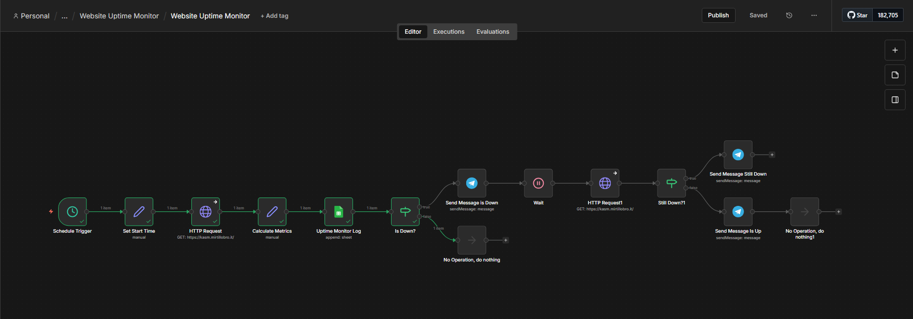
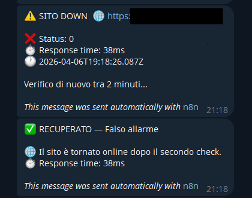
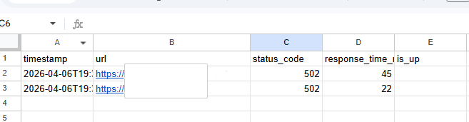

# n8n Website Uptime Monitor

> Automated website monitoring with intelligent alerting, false-positive prevention,
> and full history logging to Google Sheets.



## What it does

Monitors any website at regular intervals and alerts you via Telegram when it goes down — with a smart recheck system to avoid false alarms.

1. **Check** — Every 5 minutes, sends an HTTP request to the target URL
2. **Measure** — Calculates response time and logs status to Google Sheets
3. **Detect** — If the site is down (error or timeout), sends a Telegram alert
4. **Verify** — Waits 30 seconds, then rechecks to confirm the outage
5. **Confirm or dismiss** — Sends either a "CONFIRMED DOWN" or "RECOVERED" alert

## Screenshots

### Telegram alerts: down detection → recovery after recheck


### Google Sheets uptime log


## Architecture

```
Schedule Trigger (every 5 minutes)
  → Set Start Time (timestamp for response time calculation)
    → HTTP Request (GET target URL, timeout 10s, continue on error)
      → Calculate Metrics (status code, response time, is_up)
        → Google Sheets (append log row)
          → If (is_up == false?)
            ├── DOWN → Telegram alert ⚠️
            │           → Wait 30 seconds
            │             → HTTP Request (recheck)
            │               → If (still down?)
            │                 ├── YES → Telegram 🚨 CONFIRMED DOWN
            │                 └── NO  → Telegram ✅ RECOVERED
            │
            └── UP → No Operation (silent, just logged)
```

## Key features

- **False-positive prevention** — Two-step verification before confirming a real outage.
  First alert is a warning; only after a failed recheck does it escalate to critical.
- **Response time tracking** — Measures actual response time using timestamp
  comparison (not just status code), logged to Google Sheets for trend analysis.
- **Continue on error** — HTTP Request nodes configured with "On Error: Continue"
  so the workflow keeps running even when the target site returns errors or times out.
- **Full history** — Every check is logged to Google Sheets with timestamp, URL,
  status code, response time, and up/down status. Useful for SLA reporting.
- **Configurable** — Easy to change: target URL, check interval, timeout threshold,
  wait time between checks, notification recipients.

## Tech stack

| Component | Tool |
|---|---|
| Automation | n8n (self-hosted) |
| Monitoring | HTTP Request with timeout + error handling |
| Logging | Google Sheets |
| Alerting | Telegram Bot API |
| Scheduling | n8n Schedule Trigger (cron-based) |

## Setup

### Prerequisites
- n8n instance (self-hosted or cloud)
- Google account with Sheets API access
- Telegram Bot (create via @BotFather)

### Quick start

1. Import `workflows/website-uptime-monitor.json` into your n8n instance
2. Configure credentials:
   - Google Sheets OAuth2
   - Telegram Bot Token
3. Update these values in the workflow:
   - **Target URL** — in both HTTP Request nodes (main check and recheck)
   - **Telegram Chat ID** — in all three Telegram nodes
   - **Google Sheet ID** — in the "Uptime Monitor Log" node
4. Create a Google Sheet with columns:
   `timestamp | url | status_code | response_time_ms | is_up`
5. Activate the workflow
6. The monitor will check the target URL every 5 minutes

### Testing

To test the DOWN path without waiting for a real outage:

1. Temporarily change the target URL to a non-existent domain
   (e.g., `http://this-site-does-not-exist-12345.com/`)
2. Execute the workflow manually
3. Verify: Google Sheets logs `is_up: false`, first Telegram alert arrives,
   after 30 seconds the recheck runs, second alert confirms the outage
4. Restore the real URL when done testing

## Customization

| Setting | Where to change | Default |
|---|---|---|
| Target URL | HTTP Request nodes (2 nodes) | — |
| Check interval | Schedule Trigger → interval | 5 minutes |
| Timeout | HTTP Request → Options → Timeout | 10,000ms |
| Recheck wait | Wait node → Amount | 30 seconds |
| Alert recipient | Telegram nodes → Chat ID | — |

### Monitor multiple sites

Duplicate the workflow for each site, or modify it to accept a list of URLs
using n8n's "Split In Batches" node to check multiple sites in a single workflow run.

### Add email alerts

Add a Gmail/SMTP node in parallel with the Telegram nodes to receive
alerts via email in addition to Telegram.

## License

MIT